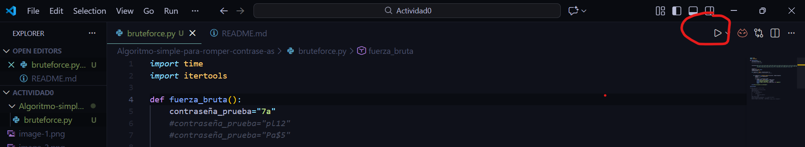
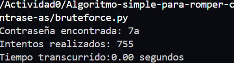
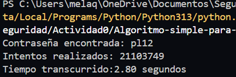
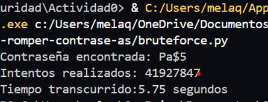

Name: Mealany Quilumba

Cómo ejecutar el programa.
Para ejecutar el programa se necesita selecionar el icono:play ubicado en la parte superior de la pantalla.

Ejemplos de salida:
Ejemplo 1:
La contraseña es "7a", que consta de seis caracteres.

Ejemplo 2:
La contraseña es "pl12", que consta de cuatro caracteres.

Ejemplo 3:
La contraseña es "Pa$5", que consta de cuatro caracteres.

Reflexión: ¿qué pasa si la contraseña tiene 8+ caracteres y usa mayúsculas, números y símbolos?
En este caso si la contraseña es "maria34_23" con mas de ocho caracteres combinados,el sistema realizaria varios intentos para ello y y el tiempo de ejecucion seria largo.

